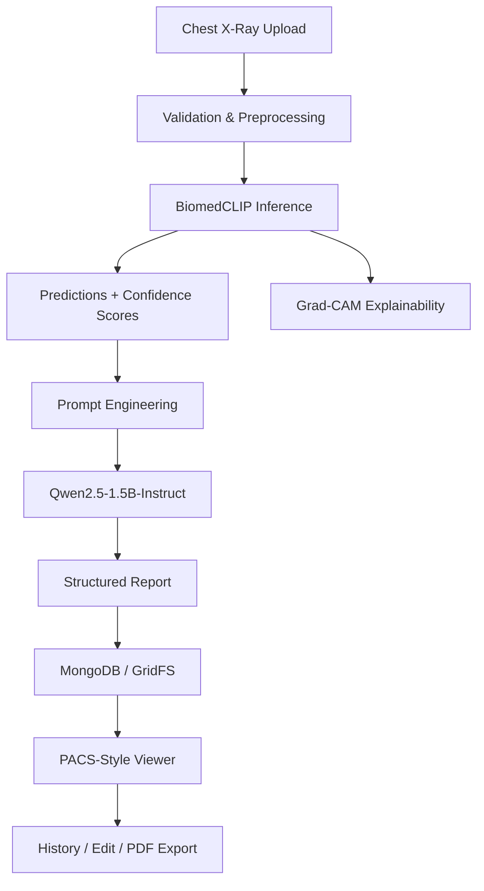

# AI-Assisted Chest X-Ray Reporting Prototype

A research prototype that integrates **BiomedCLIP** and **Qwen2.5-1.5B-Instruct** into a PACS-style workflow for AI-assisted chest X-ray analysis and structured report generation.

> **Research-use disclaimer:** This project is not clinically validated and must not be used as a medical diagnosis system.

## At a Glance

| Area | Details |
|---|---|
| Role | Final Year Project / AI System Integration |
| Language | Python |
| Frontend | Streamlit |
| Backend | FastAPI |
| Vision-Language Model | BiomedCLIP |
| Large Language Model | Qwen2.5-1.5B-Instruct |
| Database | MongoDB + GridFS |
| Medical Imaging | DICOM / pydicom |
| Explainability | Grad-CAM |
| Average end-to-end processing time | **~16.05 seconds per study** |

## What I Built

The project explores how pretrained multimodal AI models can be connected into a complete medical-imaging workflow instead of operating as isolated prediction tools.

The system supports:

- chest X-ray upload in PNG, JPG, JPEG and DICOM formats;
- file validation and image preprocessing;
- BiomedCLIP vision-language inference;
- ranked findings and confidence scores;
- Grad-CAM visual explainability;
- prompt-based structured report generation with Qwen2.5;
- study storage and retrieval using MongoDB/GridFS;
- PACS-style viewing and study history;
- report editing and PDF export; and
- controlled error handling for invalid inputs and processing failures.

## System Workflow



## Architecture

```text
Streamlit Frontend
        |
        v
FastAPI Backend
        |
        +----> Image Processing / DICOM
        |
        +----> BiomedCLIP
        |          |
        |          +----> Grad-CAM
        |
        +----> Prompt Engineering
                   |
                   v
             Qwen2.5-1.5B
                   |
                   v
             MongoDB + GridFS
```

FastAPI acts as the processing coordinator between the user interface, AI models, image-processing functions and database. During development, ngrok can be used to expose the locally running FastAPI service through a temporary public tunnel.

## Key Evaluation Results

| Evaluation | Result |
|---|---|
| Functional testing | Major test cases passed |
| Workflow integration | Complete end-to-end workflow passed |
| Average response time | **~16.05 seconds** |
| Output consistency | Same input produced repeatable results across repeated runs |
| Error handling | Invalid inputs handled without system crash |
| Stability | Repeated processing tests completed successfully |

The same chest X-ray was processed five times during consistency testing. The primary prediction, confidence score and interpretation remained consistent, with only small differences in processing time.

These results evaluate the **technical behaviour of the prototype**, not clinical diagnostic accuracy.

## AI Components

### BiomedCLIP

BiomedCLIP performs zero-shot image-text matching between an uploaded chest X-ray and predefined textual descriptions representing thoracic findings. The pretrained model is used for inference only; no additional model training is performed in this prototype.

### Qwen2.5-1.5B-Instruct

The BiomedCLIP output is inserted into a structured prompt and passed to Qwen2.5-1.5B-Instruct. The LLM generates an observational radiology-style draft containing sections such as **Technique**, **Findings** and **Impression**.

Generated reports remain editable so the workflow follows a human-in-the-loop approach.

## Dataset

The prototype uses a representative subset of the public **NIH ChestX-ray14** dataset. The full dataset contains approximately 112,000 chest X-ray images.

The project focuses on:

- system integration;
- AI inference;
- PACS-style workflow design;
- technical functionality;
- response time;
- output consistency; and
- error handling.

It does not claim clinical validation or large-scale diagnostic benchmarking.

## Technology Stack

- Python
- Streamlit
- FastAPI
- BiomedCLIP
- Qwen2.5-1.5B-Instruct
- Hugging Face Transformers
- MongoDB / GridFS
- pydicom
- Grad-CAM
- ngrok

## Repository Structure

```text
.
├── backend/                 # API and backend processing
├── frontend/                # PACS-style Streamlit interface
├── models/                  # VLM and LLM inference modules
├── scripts/                 # Preprocessing and utility scripts
├── tests/                   # Prototype tests
├── data/                    # Project data structure
├── pipeline.py              # End-to-end BiomedCLIP + Qwen pipeline
├── requirements.txt         # Python dependencies
├── FINAL REPORT.pdf         # Full academic report
└── README.md
```

## Run the Project

Install the dependencies:

```bash
pip install -r requirements.txt
```

The repository contains the project pipeline, frontend, backend, model modules and preprocessing scripts. Model availability and local environment configuration are required before running the complete workflow.

## Limitations

- Research and educational prototype only.
- Uses pretrained models without domain-specific fine-tuning.
- Not clinically validated.
- Does not report clinical metrics such as sensitivity or specificity.
- Uses a simplified PACS-style environment rather than a production hospital PACS.
- Does not include full RIS/HL7 hospital integration.
- Public datasets may not represent all clinical populations or imaging conditions.

## Skills Demonstrated

This project demonstrates practical experience in **Python, AI system integration, VLM/LLM inference, prompt engineering, API development, database integration, DICOM processing, explainable AI, testing, error handling and end-to-end workflow design**.

## Author

**Muhammad Nurhilman bin Mohd Rozalee**  
Final-year Bachelor of Information Systems (Hons.) — Intelligent Systems Engineering, UiTM  
GitHub: https://github.com/Hilman03
